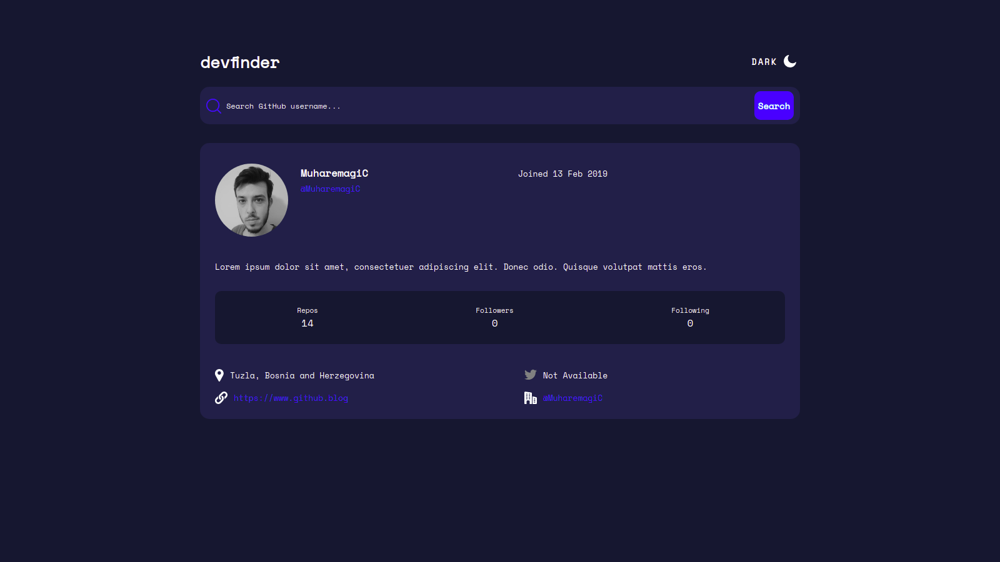

## Table of contents

- [Overview](#overview)
  - [Screenshot](#screenshot)
  - [Links](#links)
- [My process](#my-process)
  - [Built with](#built-with)
  - [What I learned](#what-i-learned)
- [Author](#author)

## Overview

### Screenshot

### Links

- Solution URL: [https://github.com/MuharemagiC/github-user-search-app.git](https://github.com/MuharemagiC/github-user-search-app)
- Live Site URL: [https://muharemagic.github.io/github-user-search-app/](https://muharemagic.github.io/github-user-search-app/)

## My process

### Built with

- CSS custom properties
- Flexbox
- React styled components
- Mobile-first workflow
- [React](https://reactjs.org/) - JS library
- [TypeScript](https://www.typescriptlang.org/) - Programming Language
- [CSS Modules](https://github.com/css-modules/css-modules/)

### What I learned

In this project I brushed my skills with React, TypeScript and React Styled Components.

### Continued development

For the future I want to improve my TypeScript, CSS and React skills. After it I will start learning new skills lik NextJS, GraphQL, NodeJS and more...

## Author

- Frontend Mentor - [@MuharemagiC](https://www.frontendmentor.io/profile/MuharemagiC)
